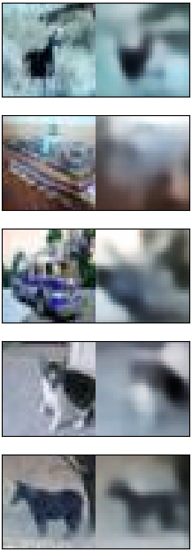
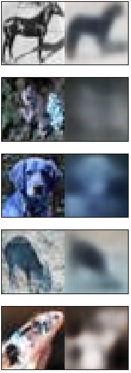
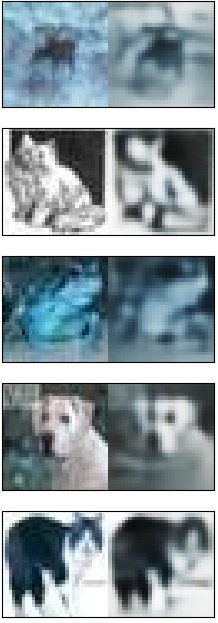

## Pytorch VAE

#### My Vae Study Project

This repo contains a simple implementation of VAE (Variational AutoEncoder) in pytorch. I refered this repo ([AntixK/PyTorch-VAE: A Collection of Variational Autoencoders (VAE) in PyTorch. (github.com)](https://github.com/AntixK/PyTorch-VAE)) vanilla_vae.py and other blogs. Thanks for everyone who posts nice codes.

 

### Requirements
- python 3.7
- pytorch >= 1.3
- opencv-python
- others in requirements.txt ...

### Installation
- git clone https://github.com/ZeroAct/vae-study-project.git
- cd vae-study-project
- pip install -r requirements.txt

### Usage
#### 1.  Make .ini file

In `conifgs` directory you will see `default.ini` file like this.


```python
[model]
input_size = [256, 256]
in_channel = 3
latent_dim = 100
hidden_dims = [64, 64, 128, 128, 256, 256]
```

This section determines the model.


```python
[hyperparameters]
epochs = 5
batch_size = 2
optimizer = adam
learning_rate = 1e-2
loss = L1
```

You can change hyperparameters here. 

`adam` is the only supported optimizer yet. 

You can use `L1`, `MSE`, `SSIM` loss functions. If you want to use other loss functions, you can implement them in `vae_pytorch/loss.py`.


```python
[data]
train_img_path = "datasets/train"
val_img_path = "datasets/val"
```

Set the image path. It will automatically get images recursively.


#### 2.  Train

After making `.ini` file, you train the model by script :

```python
python train.py -c configs/my.ini # your config file (require)
                -v 1              # validation each 1 epoch (default)
                -s 1              # save model each 1 epoch (default)
                -n 8              # num workers for DataLoader (default)
                -o True           # show reconstruction result while training (default)
```

The results(reconstruction, weights) will be saved under `logs/{.ini file name}/`. 


#### 3. Predict

After training model, you can see the encoded latent vectors and reconstructed images.

The results will be saved under `results/{.ini file name}/`.


### Results

I used cifar-10 datasets. I trained 3 models with different loss function. Each model trained for 50 epochs.

|           L1 Loss           |         MSE Loss          |    SSIM (Filter Size 3)    |
| :-------------------------: | :-----------------------: | :------------------------: |
|  |  |  |

It seems like L1 loss is better than MSE loss. Using SSIM loss was the best at reconstructing the details, but worst at reconstructing color information. (I don't know why...)


### Time Line

#### 202101-03  : initial commit

#### 2021-01-03  : Loss Class / Add Predict Code / Remove Some Errors

#### 2021-01-14  : Modify Loss functions / Remove trash files

#### 2021-01-15 : bug fix / update readme.md